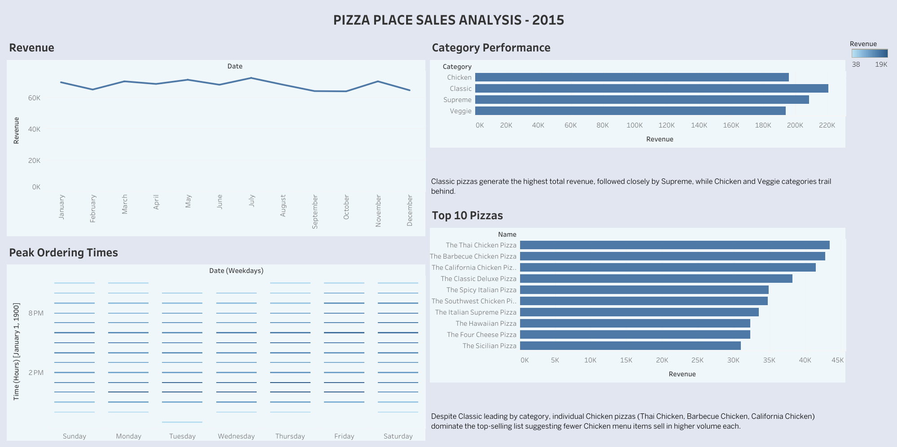

# Pizza-Place-Sales-Analysis-Dashboard
A Tableau dashboard built using the Pizza Place Sales dataset.
The project explores revenue, product category performance, top-selling items, and ordering time patterns using a full year of order data (2015) across 4 related tables.

## Dashboard Features

* Revenue Trend – Monthly revenue across the full year
* Category Performance – Compare revenue across Classic, Chicken, Supreme, and Veggie pizzas
* Top 10 Pizzas – Rank individual pizzas by total revenue
* Peak Ordering Times – See order volume by day of week and hour of day
* Text Callouts – Key findings highlighted directly on the dashboard

## Key Insights

* Classic pizzas generate the highest total revenue, followed closely by Supreme.
* Despite Classic leading by category, individual Chicken pizzas (Thai Chicken, Barbecue Chicken, California Chicken) dominate the top-10 sellers list — suggesting fewer Chicken menu items sell in higher volume each.
* Order volume is highest around [insert your actual peak hours here] across most weekdays.
* Revenue remained relatively stable month-to-month throughout 2015, with no strong seasonal spikes.

## Tools Used

* Tableau Public
* Data modelling (relationships across 4 tables: orders, order details, pizzas, pizza types)
* Calculated fields
* Interactive dashboards

## What I Learned

Through this project, I practiced:

* Connecting and relating multiple CSV tables correctly (fixing a broken relationship along the way)
* Writing calculated fields (e.g. Revenue, extracting hour-of-day from a time field)
* Building different chart types for different questions (trend lines, bar charts, heatmaps)
* Designing a dashboard layout that reads clearly at a glance
* Writing findings in plain language instead of leaving charts to speak for themselves
* Checking that a visual is actually working (e.g. confirming the heatmap showed real contrast) rather than assuming it looked right

## How to Run

1. Open the .twbx file in Tableau Public or Tableau Desktop, or view it directly via the published link.
   (https://public.tableau.com/views/Book2_17897473071760/Dashboard1?:language=en-US&publish=yes&:sid=&:redirect=auth&:display_count=n&:origin=viz_share_link)
3. Use the dashboard filters/highlight actions to explore the data interactively.

## License

This project uses a public dataset for learning and portfolio purposes.
